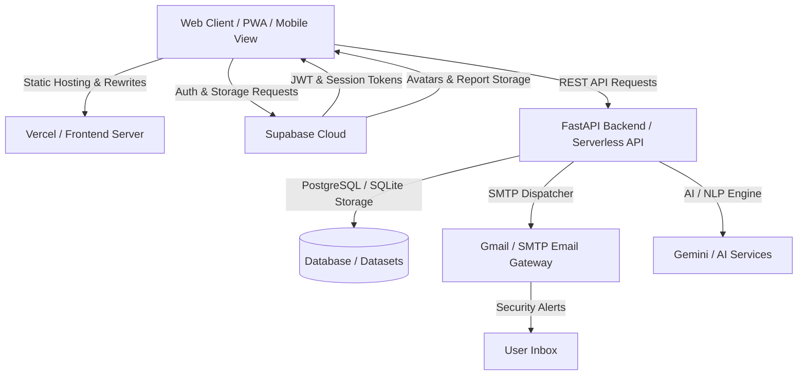

# 🏥 CuraAssist CareHub — AI Healthcare & Medical Assistant Platform

[](https://fastapi.tiangolo.com)
[](https://www.python.org/)
[](https://supabase.com)
[](https://developer.mozilla.org/en-US/docs/Web/JavaScript)
[](https://vercel.com)
[](LICENSE)

**CuraAssist CareHub** is an intelligent, full-stack digital healthcare ecosystem designed to streamline medicine discovery, personal health management, clinical AI assistance, and emergency response. Combining a reactive web interface with a high-performance FastAPI backend, Supabase authentication & storage, and an interactive real-time medication reminder engine, CuraAssist brings modern healthcare support directly to users across any device.

---

## 🌟 Key Features & Modules

### 🤖 1. AI Health Assistant & Clinical Intelligence
- **Intelligent Symptom Triage**: Interactive AI chat providing health guidance, symptom evaluation, and preliminary first-aid suggestions.
- **Drug-Drug Interaction (DDI) Checker**: Real-time cross-referencing of medication combinations to flag adverse reactions and contraindications.
- **OCR Prescription & Lab Report Scanner**: Client-side and server-assisted image processing with optical character recognition to extract medication names, dosages, and doctor notes from photos or scanned documents.

### ⏰ 2. Real-Time Medicine Reminders Engine
- **Dedicated Schedule Hub**: First-class reminders view with full interactive schedule management (Add, Edit, Delete, Toggle active states).
- **Multi-Modal Alarms**: Web Audio API synthesized alert chime paired with Native Browser Desktop Notifications.
- **Live Alarm Modal**: Prompts users at scheduled times with quick action buttons: **Take Now**, **Snooze (10 min)**, and **Skip**.
- **Adherence Tracking**: Tracks medication intake logs, streaks, and timestamps.
- **Supabase Cloud Sync**: Schedules seamlessly sync to Supabase for persistent cross-device availability.

### 🏪 3. Medicine Marketplace & Generic Alternatives
- **Comprehensive Medicine Directory**: Search across hundreds of brand-name and generic medicines with detailed indications, dosage instructions, and manufacturer information.
- **Generic Cost-Saver Comparison**: Automatic detection and recommendation of identical-formula generic alternatives with side-by-side cost breakdown.
- **Integrated Shopping Cart & Orders**: Category filtering, cart management, promotional discounts, and simulated checkout flow.
- **Community Ratings & Reviews**: User-submitted feedback, ratings, and verified experiences for medications.

### 🗺️ 4. Healthcare Services & Facilities Navigator
- **Geolocation-Based Discovery**: Interactive locator for nearby medical facilities:
  - 🏥 Hospitals & Emergency Rooms
  - 💊 Pharmacies & Chemists
  - 🩺 Clinics & Specialist Centers
  - 🔬 Diagnostic Laboratories
  - 🩸 Blood Banks
  - 🚑 Ambulance & Emergency Services
- **Turn-by-Turn Navigation**: Real-time distance calculation, operating hours, emergency hotlines, and instant Google Maps routing.

### 👤 5. Comprehensive Health Profile & Document Vault
- **Personal Health Passport**: Securely record blood type, allergies, chronic conditions, emergency contacts, and family members.
- **Multi-Format Medical Report Vault**: Upload and manage medical records, lab reports, and prescriptions (PDFs and image formats) stored securely in Supabase Storage buckets.
- **Persistent Avatar Storage**: Profile photos stored in dedicated Supabase buckets and synchronized across devices.

### 🛡️ 6. Enterprise Security & Automated Sign-In Alerts
- **Supabase Authentication**: Secure user registration, credential validation, GitHub OAuth support, and JWT token authentication.
- **Automated SMTP Login Alerts**: Real-time security email dispatcher powered by Gmail SMTP / custom mailers notifying users with device info, IP, and timestamps upon every login.
- **Complete Session Sanitization**: Comprehensive memory, state, and browser storage wipe on logout to prevent credential leakage on shared devices.

---

## 🏗️ System Architecture



---

## 📂 Project Structure

```text
ai_healthcare_system/
├── api/                                # Vercel Serverless Function entrypoint
│   └── index.py                        # Serverless bridge importing FastAPI app
├── application/
│   ├── backend/                        # High-performance FastAPI backend
│   │   ├── app/
│   │   │   ├── api/                    # Modular API route controllers
│   │   │   │   ├── auth.py             # User authentication & login dispatch
│   │   │   │   ├── chat.py             # AI Assistant & symptom chat routes
│   │   │   │   ├── home.py             # Dashboard & summary endpoints
│   │   │   │   ├── maps.py             # Healthcare facility location queries
│   │   │   │   ├── medicine.py         # Drug catalog & generic search
│   │   │   │   ├── profile.py          # Profile data & document vault endpoints
│   │   │   │   └── store.py            # Store, cart, and orders routes
│   │   │   ├── database/               # Database drivers & models (SQLAlchemy / PostgreSQL)
│   │   │   ├── services/               # Core services (email_service.py, storage.py)
│   │   │   ├── auth.py                 # JWT verification & Supabase auth handler
│   │   │   └── main.py                 # FastAPI app configuration & CORS setup
│   │   ├── data/                       # Comprehensive medical & location JSON datasets
│   │   ├── requirements.txt            # Python dependencies
│   │   └── pyproject.toml              # Backend project configuration
│   └── frontend/                       # Modern responsive frontend client
│       ├── index.html                  # Single-page application markup
│       ├── app.js                      # Core frontend application logic & reminder engine
│       ├── data.js                     # Healthcare catalog & fallback dataset
│       ├── ocr-image-processor.js      # Client-side OCR image pre-processing
│       ├── styles.css                  # UI theme, layout, and responsive styles
│       ├── sitemap.xml                 # SEO sitemap
│       └── robots.txt                  # Search engine crawler policies
├── public/                             # Production build assets (mirrored frontend)
├── supabase/                           # Supabase configurations & database definitions
├── vercel.json                         # Vercel deployment rewrites & serverless routes
├── requirements.txt                    # Root Python dependencies
└── README.md                           # Project documentation
```

---

## 🛠️ Technology Stack

| Layer | Technologies |
|---|---|
| **Frontend** | HTML5, CSS3 (Glassmorphism, Responsive Grid), Vanilla JavaScript (ES6+), Web Audio API, Web Notifications API, Tesseract OCR |
| **Backend** | Python 3.11+, FastAPI, Pydantic v2, SQLAlchemy, Uvicorn |
| **Authentication** | Supabase Auth (Email/Password, GitHub OAuth, JWT validation) |
| **Database & Storage** | PostgreSQL, Supabase Storage Buckets (Avatars, Medical Documents), SQLite/JSON datasets |
| **Security & Email** | Python `smtplib`, `email.mime`, Gmail App Passwords, CORS protection, JWT token decoding |
| **Hosting & Deployment** | Vercel (Frontend & Serverless API), FastAPI Cloud Engine |

---

## 🚀 Getting Started & Local Setup

### Prerequisites
- **Python 3.11+** installed
- **Node.js / Live Server / Python HTTP server** (for local frontend serving)
- **Git** installed

### 1. Clone the Repository
```bash
git clone https://github.com/rahul020307/ai_healthcare_system.git
cd ai_healthcare_system
```

### 2. Backend Setup
Navigate to the backend directory, set up a virtual environment, and install dependencies:

```bash
cd application/backend
python3 -m venv .venv
source .venv/bin/activate  # On Windows: .venv\Scripts\activate
pip install -r requirements.txt
```

Start the FastAPI development server:
```bash
uvicorn app.main:app --host 0.0.0.0 --port 8000 --reload
```
The interactive API documentation (Swagger UI) will be accessible at `http://localhost:8000/docs`.

### 3. Frontend Setup
In a new terminal window, serve the frontend from the root directory:

```bash
# Using Python's built-in HTTP server:
python3 -m http.server 3000
```
Open `http://localhost:3000` in your web browser.

---

## ⚙️ Environment Variables

Create a `.env` file in the root and/or `application/backend/` directory with the following configuration:

```env
# Supabase Configuration
SUPABASE_URL=https://your-project.supabase.co
SUPABASE_KEY=your-supabase-anon-or-service-key
SUPABASE_JWT_SECRET=your-supabase-jwt-secret

# SMTP Email Configuration (for Security Login Alerts)
SMTP_HOST=smtp.gmail.com
SMTP_PORT=465
SMTP_USER=your-email@gmail.com
SMTP_PASS=your-google-app-password
SMTP_FROM=your-email@gmail.com
SMTP_USE_SSL=true
```

---

## 📡 API Endpoints Overview

| Endpoint Prefix | Description | Key Routes |
|---|---|---|
| `/auth` | Authentication & Security | `POST /auth/notify-login` |
| `/chat` | AI Health Assistant | `POST /chat/message`, `POST /chat/symptoms`, `POST /chat/ocr` |
| `/medicine` | Drug Catalog & Generic Finder | `GET /medicine/search`, `GET /medicine/alternatives/{id}` |
| `/store` | Store, Cart & Orders | `GET /store/products`, `POST /store/order` |
| `/maps` | Healthcare Facility Locator | `GET /maps/nearby`, `GET /maps/facilities/{type}` |
| `/profile` | User Profiles & Medical Vault | `GET /profile/records`, `POST /profile/upload-report` |
| `/home` | Dashboard & Daily Summaries | `GET /home/summary`, `GET /home/tips` |

---

## ⚠️ Medical & Clinical Disclaimer

> [!IMPORTANT]
> **CuraAssist CareHub** is designed for educational, informational, and personal organizational purposes only. The AI Assistant, symptom evaluation, and generic medicine comparison features do not constitute professional medical advice, diagnosis, or treatment. Always consult a qualified healthcare provider for any medical concerns or emergency situations.

---

## 📄 License

This project is licensed under the MIT License — see the [LICENSE](LICENSE) file for details.
